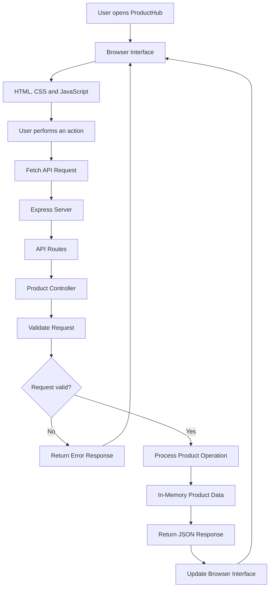
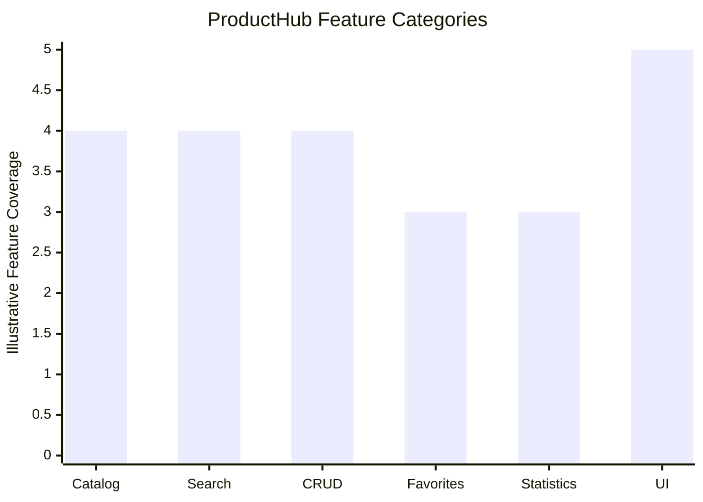

# ProductHub API

### A Full-Stack Product Catalog & REST API Management Application

ProductHub API is a full-stack web application built to demonstrate RESTful API development, backend integration, product management, and interactive frontend development. It provides a responsive interface for browsing, searching, filtering, sorting, and managing products through a Node.js and Express backend.

The project combines a browser-based product catalog with REST API endpoints, allowing users to explore product information and perform CRUD operations through the application.

## Live Demo

**Live Application:** [ProductHub API](https://product-hub-api-weld.vercel.app/)

Explore the deployed application to see the product catalog interface and its available features.

**Developer:** Rachit Tripathi  
**GitHub:** [@rachit1807](https://github.com/rachit1807)

---

## Table of Contents

- [About the Project](#about-the-project)
- [Project Objectives](#project-objectives)
- [Key Features](#key-features)
- [Application Workflow](#application-workflow)
- [Feature Overview Graph](#feature-overview-graph)
- [Technology Stack](#technology-stack)
- [REST API Documentation](#rest-api-documentation)
- [Project Structure](#project-structure)
- [Installation and Setup](#installation-and-setup)
- [Environment and Configuration](#environment-and-configuration)
- [Data Storage and Limitations](#data-storage-and-limitations)
- [Learning Outcomes](#learning-outcomes)
- [Future Improvements](#future-improvements)
- [About the Author](#about-the-author)
- [License](#license)

---

## About the Project

ProductHub API is a product catalog and management application designed to demonstrate how a frontend application communicates with a backend REST API.

Users can browse products, search by product ID or name, filter products by category, sort results, save favorite products, and manage product information through CRUD operations.

The frontend communicates with the Express server using the browser's Fetch API. The server processes incoming requests, validates product information, executes the requested operation, and returns JSON responses.

Unlike a complete e-commerce platform, ProductHub focuses on the **product catalog and API integration layer** rather than payments, shopping carts, authentication, or order processing.

### Why I Built This Project

I created ProductHub to gain practical experience with full-stack web development and understand how individual application components work together.

The project gave me an opportunity to apply:

- RESTful API design principles.
- Express.js routing and controller organization.
- HTTP methods and JSON-based communication.
- Frontend-to-backend integration using Fetch API.
- CRUD operations for product management.
- Input validation and HTTP error handling.
- DOM manipulation using vanilla JavaScript.
- Browser storage using `localStorage`.
- Responsive user interface development.
- Deployment of a web application.

## Project Objectives

The primary objectives of ProductHub API are:

1. Build a REST API using Node.js and Express.
2. Organize backend logic using routes and controllers.
3. Create a frontend that consumes API endpoints.
4. Implement product retrieval, creation, updating, and deletion.
5. Provide search, filtering, and sorting functionality.
6. Add a favorites feature using browser storage.
7. Display catalog statistics and product details.
8. Validate incoming product data.
9. Handle successful responses and API errors.
10. Create a responsive and user-friendly interface.

---

## Key Features

### 1. Product Catalog

- Retrieve and display products from the backend API.
- Present products in a structured card-based layout.
- View detailed information about individual products.
- Display product information such as name, category, price, and description.

### 2. Search and Discovery

- Search for a product using its ID.
- Search products by name.
- Filter products by category.
- Sort products by price in ascending or descending order.
- Sort product names alphabetically in either direction.
- Clear search and filter selections to return to the catalog.

### 3. Favorites Management

- Add products to favorites.
- Remove products from favorites.
- Save favorite product IDs in browser `localStorage`.
- Switch between the full catalog and saved favorites, where supported by the interface.

Favorites are stored in the browser rather than in the backend.

### 4. Product CRUD Operations

ProductHub supports the four fundamental CRUD operations:

| Operation | HTTP Method | Purpose |
|---|---|---|
| Create | `POST` | Add a new product |
| Read | `GET` | Retrieve product information |
| Update | `PUT` | Modify an existing product |
| Delete | `DELETE` | Remove a product |

Product management is supported through the API, with interface controls for product management where implemented.

### 5. Product Details

The product details dialog displays additional information about a selected product without requiring users to navigate away from the catalog.

### 6. Catalog Statistics

The application is designed to present useful information about the catalog, including:

- Total number of products.
- Number of product categories.
- Average product price.
- Number of saved favorites.

The statistics depend on the data and functionality implemented in the deployed version.

### 7. Dark Mode

The interface supports dark mode to provide an alternative viewing experience.

The selected theme preference is stored in browser `localStorage`, allowing the browser to retain the preference between visits.

### 8. Loading Indicators

A loading indicator provides feedback while product data is being retrieved from the API.

### 9. Toast Notifications

Toast notifications can provide feedback for supported user actions, such as successful operations or errors.

### 10. Input Validation

The API validates product information before processing create and update requests.

Validation rules include:

- Product name must not be empty.
- Category must not be empty.
- Price must be numeric.
- Price must be greater than or equal to zero.
- A product ID must identify an existing product for operations that require one.

### 11. Responsive Interface

The interface uses HTML, CSS, and vanilla JavaScript to provide a layout intended to adapt to different screen sizes.

---

## Application Workflow

The following flowchart illustrates the application's main request-and-response workflow.



### How the Workflow Works

1. The user opens the ProductHub application.
2. The browser loads the HTML, CSS, and JavaScript files.
3. The user performs an action, such as loading or searching for products.
4. The frontend sends an HTTP request using Fetch API.
5. Express receives the request and forwards it to the appropriate API route.
6. The product controller processes the request and validates relevant input.
7. The controller retrieves or modifies the product data.
8. The server returns a JSON response.
9. The frontend processes the response and updates the displayed information.

This architecture separates the user interface, routing, business logic, and product data into distinct components.

---

## Feature Overview Graph

The following bar graph is a **qualitative visualization of the project's feature categories**, not a measurement of performance, usage, or test coverage.



**Graph interpretation:**

- **Catalog:** Product listing and product details.
- **Search:** Search, filtering, and sorting.
- **CRUD:** Product creation, retrieval, updating, and deletion.
- **Favorites:** Browser-based favorite management.
- **Statistics:** Catalog summary information.
- **UI:** Responsive layout, theme support, loading feedback, and dialogs.

The values are illustrative labels for feature categories. They do not represent measured quality or the number of completed tests.

---

## Technology Stack

| Area | Technology | Purpose |
|---|---|---|
| Runtime | Node.js | Executes the backend JavaScript |
| Backend Framework | Express.js 5 | Handles HTTP requests and API routes |
| Frontend Structure | HTML5 | Defines the application interface |
| Styling | CSS3 | Provides layout, themes, and responsive styles |
| Frontend Logic | Vanilla JavaScript | Handles interactions and DOM updates |
| HTTP Communication | Fetch API | Sends requests from the browser to the server |
| Browser Storage | `localStorage` | Stores favorites and theme preferences |
| API Data Format | JSON | Exchanges product data between frontend and backend |
| Development Tools | npm | Installs dependencies and runs project scripts |
| Version Control | Git and GitHub | Tracks and hosts source code |

### Why These Technologies?

**Node.js and Express.js**

These technologies provide the backend environment for creating HTTP endpoints, defining routes, processing requests, and returning JSON responses.

**HTML, CSS, and JavaScript**

The frontend uses standard browser technologies without a frontend framework. This keeps the interface lightweight and demonstrates fundamental JavaScript and DOM manipulation skills.

**Fetch API**

Fetch API connects the browser interface to the backend, allowing product information to be retrieved and product operations to be performed asynchronously.

**localStorage**

Browser storage is used for user-specific interface preferences and favorites. It does not replace a persistent backend database.

---

## REST API Documentation

All API endpoints use the `/api` prefix.

### Base URL

For local development:

```text
http://localhost:8081/api
```

The deployed application is available at:

[https://product-hub-api-weld.vercel.app/](https://product-hub-api-weld.vercel.app/)

Deployment behavior may differ from local development depending on the hosting configuration.

### Available Endpoints

| HTTP Method | Endpoint | Description |
|---|---|---|
| `GET` | `/api` | Returns API status information |
| `GET` | `/api/products` | Retrieves the product catalog |
| `GET` | `/api/products/:id` | Retrieves a product by ID |
| `POST` | `/api/products` | Creates a new product |
| `PUT` | `/api/products/:id` | Updates an existing product |
| `DELETE` | `/api/products/:id` | Deletes a product |

### 1. Check API Status

**Request**

```http
GET /api
```

Use this endpoint to check the API status response.

### 2. Retrieve All Products

**Request**

```http
GET /api/products
```

This endpoint returns the product catalog.

Example request using cURL:

```bash
curl http://localhost:8081/api/products
```

### 3. Retrieve a Product by ID

**Request**

```http
GET /api/products/1
```

Example:

```bash
curl http://localhost:8081/api/products/1
```

Replace `1` with the ID of the product you want to retrieve.

### 4. Create a Product

**Request**

```http
POST /api/products
```

Example:

```bash
curl -X POST http://localhost:8081/api/products \
  -H "Content-Type: application/json" \
  -d '{
    "name": "USB-C Hub",
    "category": "Electronics",
    "price": 1499,
    "description": "7-in-1 adapter"
  }'
```

The server assigns the product ID.

### 5. Update a Product

**Request**

```http
PUT /api/products/1
```

Example:

```bash
curl -X PUT http://localhost:8081/api/products/1 \
  -H "Content-Type: application/json" \
  -d '{
    "price": 899
  }'
```

The request can include one or more supported product fields.

### 6. Delete a Product

**Request**

```http
DELETE /api/products/1
```

Example:

```bash
curl -X DELETE http://localhost:8081/api/products/1
```

The endpoint removes the specified product if it exists.

### Product Data Structure

A product is represented using JSON.

```json
{
  "id": 1,
  "name": "Wireless Mouse",
  "category": "Electronics",
  "price": 799,
  "description": ""
}
```

| Field | Type | Description |
|---|---|---|
| `id` | Number | Unique product identifier assigned by the server |
| `name` | String | Product name |
| `category` | String | Product category |
| `price` | Number | Product price, which must be non-negative |
| `description` | String | Optional product description |

### API Responses and Error Handling

API responses use JSON.

Successful responses include:

```json
{
  "success": true,
  "data": {}
}
```

The actual structure of `data` depends on the endpoint.

Expected error handling includes:

| HTTP Status | Meaning |
|---|---|
| `200 OK` | Request completed successfully |
| `201 Created` | Resource created successfully, where returned by the implementation |
| `400 Bad Request` | Invalid or incomplete product data |
| `404 Not Found` | Requested product does not exist |
| `500 Internal Server Error` | Unexpected server-side error |

The exact status code for a successful operation depends on the endpoint implementation.

---

## Project Structure

```text
ProductHub-API/
│
├── controllers/
│   └── productController.js
│
├── data/
│   └── products.js
│
├── public/
│   ├── index.html
│   ├── style.css
│   └── app.js
│
├── routes/
│   └── api.js
│
├── server.js
├── package.json
├── package-lock.json
└── README.md
```

### Directory Responsibilities

**`controllers/`**

Contains the product controller, which handles product operations and relevant validation.

**`data/`**

Contains the starter product catalog.

**`public/`**

Contains the frontend files served to the browser:

- `index.html` defines the page structure.
- `style.css` controls layout, themes, and responsive styles.
- `app.js` handles user interactions and API requests.

**`routes/`**

Defines API endpoints and connects incoming requests to the appropriate controller functions.

**`server.js`**

Configures the Express application, serves static frontend files, and starts the HTTP server.

**`package.json`**

Defines project metadata, dependencies, and available npm scripts.

---

## Installation and Setup

Follow these instructions to run the application locally.

### Prerequisites

Install the following software:

- Node.js 18 or later.
- npm, which is included with Node.js.
- Git, if you want to clone the repository.

### Step 1: Clone the Repository

Replace `<repository-url>` with your actual GitHub repository URL.

```bash
git clone <repository-url>
```

### Step 2: Open the Project Directory

```bash
cd ProductHub-API
```

### Step 3: Install Dependencies

```bash
npm install
```

### Step 4: Start the Application

```bash
npm start
```

This command uses the start script defined in `package.json`.

### Step 5: Open the Application

Open the following URL in your browser:

```text
http://localhost:8081
```

The API status endpoint is available at:

```text
http://localhost:8081/api
```

The product collection endpoint is available at:

```text
http://localhost:8081/api/products
```

**Note:** The local port is `8081`, as specified in the project's server configuration. If the application does not start, check the `scripts` section in `package.json` and the port configuration in `server.js`.

---

## Environment and Configuration

The project uses Node.js and Express to serve the frontend and handle API requests.

### Server Port

The local server uses port `8081`, configured in `server.js`.

If you change the server port, make sure the browser frontend and local URLs remain consistent with that configuration.

### Database Configuration

The current project uses an in-memory product catalog. It does not require a database connection or database credentials.

### Deployment

The live application is available at:

**[https://product-hub-api-weld.vercel.app/](https://product-hub-api-weld.vercel.app/)**

The deployment's API behavior depends on how the application is configured on the hosting platform. In particular, in-memory data is not a substitute for persistent database storage.

---

## Data Storage and Limitations

ProductHub demonstrates basic product management, but it is intentionally limited in scope.

### In-Memory Product Data

The starter catalog is stored in the server's memory.

When the server is running, product creation, updates, and deletions affect that in-memory catalog. Restarting a conventional long-running Node.js server restores the starter data.

On serverless hosting platforms, an in-memory catalog may reset between separate execution instances or invocations. Therefore, users should not assume that product changes made on the deployed application will persist.

### Browser Storage

The application uses browser `localStorage` for:

- Favorite product IDs.
- Theme preference.

This data is stored in the user's browser rather than in a shared database.

### Current Limitations

- No persistent database is configured.
- No user authentication or authorization system is included.
- Favorites are browser-specific.
- Product changes are not guaranteed to survive server restarts or serverless execution changes.
- The project does not currently include an automated test suite.
- It is a product catalog and API management application, not a complete e-commerce system.
- Payment processing, order management, inventory synchronization, and user accounts are outside the current scope.

These limitations provide clear opportunities for future development.

---

## Learning Outcomes

Building ProductHub provided practical experience with several full-stack development concepts.

### Backend Development

- Creating an Express application.
- Defining REST API endpoints.
- Separating routes from controller logic.
- Processing HTTP requests and JSON payloads.
- Implementing CRUD operations.
- Validating incoming data.
- Returning structured JSON responses.

### Frontend Development

- Building a browser interface with HTML and CSS.
- Using vanilla JavaScript for interactivity.
- Manipulating the DOM dynamically.
- Fetching data asynchronously.
- Displaying loading and error states.
- Implementing search, filters, and sorting.
- Saving interface preferences in `localStorage`.

### API Integration

- Connecting frontend actions to backend endpoints.
- Understanding HTTP methods.
- Working with JSON request and response bodies.
- Handling API errors.
- Separating presentation logic from backend operations.

### Software Organization

- Structuring a project into logical directories.
- Separating routing, controller logic, data, and frontend assets.
- Documenting endpoints and installation instructions.
- Using Git and GitHub for source control.

---

## Future Improvements

Potential improvements include:

- Integrating MongoDB or PostgreSQL for persistent storage.
- Adding user registration and authentication.
- Implementing role-based access control.
- Adding pagination for larger product catalogs.
- Introducing automated API tests.
- Improving request validation and centralized error handling.
- Adding product image uploads.
- Implementing server-side search and filtering.
- Adding API documentation with Swagger or OpenAPI.
- Setting up continuous integration and automated deployment.
- Adding inventory tracking and stock management.
- Introducing audit logs for product changes.

These are possible future enhancements and are not claims about the current implementation.

---

## About the Author

**Rachit Tripathi**  
Aspiring Software Developer | Full-Stack Web Development

I am an aspiring software developer interested in building practical applications and strengthening my skills in software development, backend engineering, and API integration.

I developed ProductHub API as a hands-on project to understand how a frontend application communicates with a backend server through RESTful APIs. The project helped me practice Express.js routing, controller-based organization, CRUD operations, input validation, browser-side state management, and responsive interface development.

My focus is on building projects that demonstrate practical engineering concepts, maintainable code organization, and a clear understanding of how application components work together.

### Connect With Me

- **GitHub:** [github.com/rachit1807](https://github.com/rachit1807)
- **LinkedIn:** [linkedin.com/in/rachittripathi2509](https://linkedin.com/in/rachittripathi2509)
- **Live Project:** [ProductHub API](https://product-hub-api-weld.vercel.app/)

I welcome feedback, suggestions, and opportunities to collaborate on software development projects.

---

## License

A license has not been specified for this project yet. If you intend to make the source code available for reuse or contributions, consider adding an appropriate `LICENSE` file to the repository.

---

**Built by Rachit Tripathi**